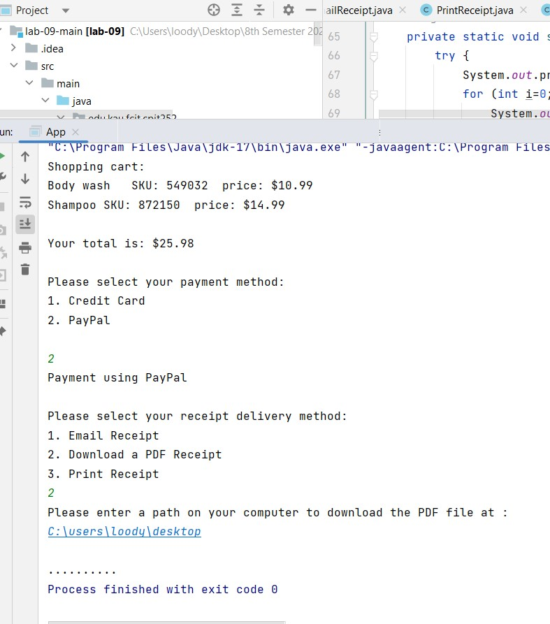
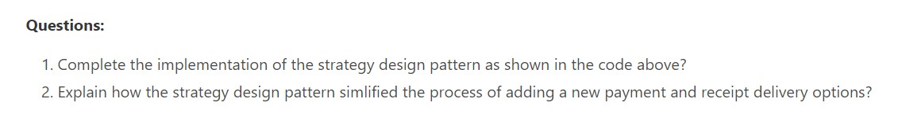

# CPIT252-Lab9-submission
This is the submission file for lab 9 activity for CPIT252

Output:

------------------

A1: By making an abstract super class or interface that has the base code for payment and receipt, concreate payment and receipt classes can inherit them by extending or implementing them and then each subclass can add their concreate specific implementaion as they like. 

In run time, the system will implement the correct payment or recepit delivery option while in run time.
